<p align="center">
  
</p>

<h1 align="center">FERRUM</h1>

<p align="center">
  <strong>Production-Grade Deep Learning Framework in Pure Rust</strong>
</p>

<p align="center">
  <a href="LICENSE"></a>
  <a href="https://www.rust-lang.org/"></a>
  <a href="https://github.com/pratikacharya1234/FERRUM/releases"></a>
  
</p>

<p align="center">
  <em>Zero Python. Zero GIL. Zero Overhead.</em>
</p>

---

## What is FERRUM?

FERRUM (Latin for "iron", Fe) is a fully functional deep learning framework written entirely in Rust. It provides a PyTorch-like API for building and training neural networks.

### Working Features

| Feature | Status | Verified |
|---------|--------|----------|
| N-dimensional tensors | Complete | Yes |
| Automatic differentiation | Complete | Yes |
| Neural networks (Linear, ReLU, etc.) | Complete | Yes |
| Backpropagation training | Complete | XOR 100% accuracy |
| SGD and Adam optimizers | Complete | Yes |
| Learning rate schedulers | Complete | 8 schedulers |
| Embedding layer (NLP) | Complete | Yes |
| PyTorch-style DataLoader | Complete | Yes |
| Save/load models | Complete | Yes |
| Unit tests | 154 passing | Yes |

### Current Limitations

| Feature | Status | Notes |
|---------|--------|-------|
| Real CUDA GPU | Simulated | Kernel stubs, no actual CUDA |
| Conv2d layers | Planned | v1.1 |
| LSTM/GRU layers | Planned | v1.1 |
| Transformers | Planned | v1.2 |
| BLAS optimization | Not yet | Uses naive matmul |
| Distributed training | Simulated | Infrastructure exists |

### Best Use Cases

- Learning Rust + ML
- Small neural networks (MLPs, classifiers)
- Research prototypes
- Embedded/Edge ML (no Python dependency)

---

## Quick Start

### Installation

```toml
[dependencies]
ferrum = { git = "https://github.com/pratikacharya1234/FERRUM" }
```

Or build from source:

```bash
git clone https://github.com/pratikacharya1234/FERRUM.git
cd FERRUM
cargo build --release
cargo test
```

### XOR Training Example

```rust
use ferrum::prelude::*;

fn main() -> Result<()> {
    // XOR dataset
    let inputs = Tensor::from_slice(&[0., 0., 0., 1., 1., 0., 1., 1.], [4, 2], Device::Cpu);
    let targets = Tensor::from_slice(&[0., 1., 1., 0.], [4, 1], Device::Cpu);

    // Build model: 2 -> 8 -> 1
    let model = Sequential::new()
        .add(Linear::new(2, 8))
        .add(Tanh::new())
        .add(Linear::new(8, 1))
        .add(Sigmoid::new());

    // Train
    let optimizer = SGD::new(model.parameters(), SGDConfig { lr: 1.0, ..Default::default() });
    
    for epoch in 0..2000 {
        let output = model.forward(&inputs)?;
        let loss = bce_loss(&output, &targets)?;
        
        backward(&loss)?;
        optimizer.step()?;
        optimizer.zero_grad();
    }
    
    // Test - achieves 100% accuracy
    let predictions = model.forward(&inputs)?;
    println!("Predictions: {:?}", predictions);
    
    Ok(())
}
```

Run the example:

```bash
cargo run --example train_xor
# Output: Accuracy: 4/4 (100.0%)
```

---

## Crate Structure

```
ferrum/
  ferrum-core        Tensor, DType, Device, Shape, Storage
  ferrum-autograd    Automatic differentiation, backward pass
  ferrum-ops         Tensor operations (add, matmul, etc.)
  ferrum-nn          Neural network layers
  ferrum-optim       Optimizers (SGD, Adam)
  ferrum-data        DataLoader, Dataset, Samplers
  ferrum-distributed Distributed training (DDP)
  ferrum-cuda        GPU support (simulated)
  ferrum-serialize   Save/load models
  ferrum-examples    Working examples
  ferrum             Main facade crate
```

---

## Neural Network Layers

```rust
use ferrum::prelude::*;

let model = Sequential::new()
    .add(Linear::new(784, 256))
    .add(ReLU::new())
    .add(LayerNorm::new(vec![256]))
    .add(Linear::new(256, 10))
    .add(Softmax::new(-1));

let output = model.forward(&input)?;
```

### Available Layers

| Layer | Description |
|-------|-------------|
| Linear | Fully connected |
| ReLU, Sigmoid, Tanh | Basic activations |
| GELU, SiLU, LeakyReLU, ELU | Advanced activations |
| Softmax, LogSoftmax | Probability outputs |
| LayerNorm, BatchNorm1d | Normalization |
| Dropout | Regularization |
| Sequential | Layer container |

---

## Data Loading

```rust
use ferrum::prelude::*;

let dataset = TensorDataset::new(train_inputs, train_targets);

let loader = DataLoader::new(dataset)
    .batch_size(32)
    .shuffle(true)
    .num_workers(4);

for batch in &loader {
    let (inputs, targets) = batch;
    // training code
}
```

---

## Optimizers

```rust
// SGD with momentum
let optimizer = SGD::new(params, SGDConfig {
    lr: 0.01,
    momentum: 0.9,
    weight_decay: 1e-4,
    ..Default::default()
});

// Adam
let optimizer = Adam::new(params, AdamConfig {
    lr: 0.001,
    betas: (0.9, 0.999),
    eps: 1e-8,
    weight_decay: 0.0,
});

// Training step
optimizer.zero_grad();
let loss = compute_loss()?;
backward(&loss)?;
optimizer.step()?;
```

---

## Loss Functions

| Function | Use Case |
|----------|----------|
| mse_loss | Regression |
| bce_loss | Binary classification |
| cross_entropy_loss | Multi-class classification |
| nll_loss | With log_softmax output |
| l1_loss | Robust regression |
| smooth_l1_loss | Object detection |

---

## Running Tests

```bash
cargo test --workspace         # All 154 tests
cargo test -p ferrum-autograd  # Specific crate
cargo test -- --nocapture      # With output
```

---

## Roadmap

### v1.1 (Planned)
- Conv2d, MaxPool2d layers
- BLAS integration (OpenBLAS)

### v1.2 (Planned)
- LSTM, GRU layers
- Real CUDA support

### v1.3 (Planned)
- Transformer layers
- Attention mechanisms

---

## Contributing

Contributions welcome. See [CONTRIBUTING.md](CONTRIBUTING.md).

Priority areas:
1. Convolutional layers
2. BLAS integration
3. Real CUDA kernels
4. More examples

---

## License

Apache 2.0

---

## Acknowledgments

Inspired by PyTorch, tch-rs, and candle.

---

FERRUM is a real, working framework suitable for learning, prototypes, and small projects. For production ML at scale, consider PyTorch, TensorFlow, or JAX.
