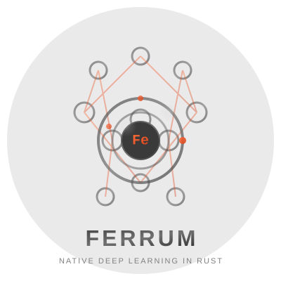

<p align="center">
  
</p>

<h1 align="center">FERRUM</h1>

<p align="center">
  <strong>A deep learning framework in pure Rust, with runtime-loaded CUDA</strong>
</p>

<p align="center">
  <a href="LICENSE"></a>
  <a href="https://www.rust-lang.org/"></a>
  
</p>

---

FERRUM is an **experimental** deep learning framework written entirely in Rust:

1. **A training stack** — tensors, tape-based autograd, `ferrum-nn` layers,
   SGD/Adam — that trains real models end to end (XOR at 100% accuracy;
   CIFAR-10 MLP on real data: test accuracy 39.8% after 3 epochs on a
   5000-image subset, vs 10% random baseline).
2. **A CUDA compute layer** — the CUDA Driver API, cuBLAS, and NVRTC loaded
   at runtime via `dlopen`, no CUDA toolkit needed at compile time — benchmarked
   on an A100 at 144+ TFLOPS TF32 and ~270 TFLOPS FP16.

**As of 2026-07-25, end-to-end GPU training is verified on an A100:**
`Tensor` ops on `Device::Cuda` dispatch to cuBLAS/NVRTC kernels (41/41 on
the `examples/gpu_smoke.rs` correctness gate, including autograd gradient
parity with CPU), and **CIFAR-10 trains on GPU with a loss curve numerically
equivalent to CPU at ~165× the speed (0.2 s/epoch vs 33 s)**. F32 only for
now; anything unimplemented on GPU errors loudly instead of silently falling
back to CPU. See [Known Limitations](#known-limitations).

---

## Verified Performance (NVIDIA A100-SXM4-40GB)

Measured with `cargo run --release --example bench` on Google Colab
(CUDA 12). These exercise the raw `ferrum-cuda` layer directly — **not** the
`Tensor` API.

| Benchmark | FERRUM | PyTorch reference (same GPU) | Verdict |
|---|---|---|---|
| Matmul TF32, 4096³ | **144–162 TFLOPS** | ~156 TFLOPS | Match |
| Matmul FP16, 4096³ | **272 TFLOPS** | ~312 TFLOPS | −13% |
| Fused element-wise chain, 1M elems | **~30 µs** | ~30 µs | Match |
| Alloc + fill bandwidth, 256 MB | **~2850 GB/s** | ~2000 GB/s | Faster |

Why the FP16 gap: FERRUM calls `cublasGemmEx`, which tops out around
270–290 TFLOPS for this shape. PyTorch reaches ~312 through `cublasLt` with
workspace allocation and heuristic algorithm search. Closing this requires
implementing the `cublasLt` path (roadmap), not tuning constants — we measured
the alternatives (`CUBLAS_GEMM_DEFAULT` drops to ~230).

---

## What Works Today

- **Tensor system (CPU)**: n-dim tensors, broadcasting, views, F32/F64/I32/I64/F16/Bool,
  creation ops, indexing, reductions, `cat`/`stack`/`squeeze`/`unsqueeze`.
- **Autograd**: tape-based reverse-mode AD with verified backward passes for
  `add`, `sub`, `mul`, `div` (all with broadcast gradient reduction), `matmul`,
  `sum`, `mean`, `sum_dim`, `cat`, `pow`, `exp`, `log`, `relu`, `sigmoid`,
  `tanh`, `neg`. Gradient accumulation and `no_grad`.
- **End-to-end training**: `Linear` + activations + `SGD`/`Adam` train real
  models. Optimizer steps update parameters in place through shared storage.
- **CUDA via dlopen**: driver API (`libcuda.so.1`), cuBLAS (`libcublas.so`),
  NVRTC-compiled fused element-wise kernels, a GPU memory pool. The same binary
  runs on machines with or without a GPU.
- **Data utilities**: `Dataset`, `DataLoader`, samplers, transforms.
- **217 passing tests** across the workspace (see
  [IMPLEMENTATION_STATUS.md](IMPLEMENTATION_STATUS.md) for the per-crate
  breakdown and what the tests do and don't cover).

## Known Limitations

Read this before choosing FERRUM for anything real:

1. **GPU compute is F32-only and requires backend registration.** Call
   `ferrum_cuda::register_gpu_backend()` at startup (the examples do this
   automatically when they detect a GPU). Other dtypes on `Device::Cuda`
   error loudly. Verified 28/28 on A100 by
   `cargo run --release --example gpu_smoke`; re-run it after touching
   dispatch or kernel code.
2. **CPU `matmul` is a naive triple loop.** The tiled/parallel/BLAS variants in
   `ferrum-ops` exist but are not wired into `Tensor::matmul`. CPU training is
   correct but slow — fine for examples, not for real workloads.
3. **`expand` is invisible to autograd.** Pre-expanding a tensor
   (`t.unsqueeze(0)?.expand(...)`) before an op yields a gradient with the
   *expanded* shape. Use implicit broadcasting (`x.add(&bias)`) instead — its
   backward correctly reduces gradients to each operand's shape.
4. **Training is verified for MLP-style models only.** Conv, LSTM, GRU, and
   Transformer layers have forward implementations and unit tests, but their
   end-to-end trainability has not been demonstrated; several rely on ops whose
   backward coverage is untested.
5. **The MNIST example is forward-only** on synthetic data (no backward pass,
   no optimizer step). It demonstrates the API, not learning. Use the XOR and
   CIFAR-10 examples for real training.
6. **`ferrum-serialize` has no tests.** Treat save/load as unverified.
7. **FP16 matmul uses a CUDA-12-deprecated algorithm constant**
   (`CUBLAS_GEMM_DEFAULT_TENSOR_OP = 99`) because it measures 272 vs 230
   TFLOPS against the non-deprecated default. This is a deliberate,
   documented trade-off in `ferrum-cuda/src/cublas.rs`.

---

## Quick Start

```bash
git clone https://github.com/pratikacharya1234/FERRUM.git
cd FERRUM
cargo build --release
cargo test --workspace
```

### Train XOR (verified: 100% accuracy)

```bash
cargo run --release --example train_xor_autograd
```

The core pattern, from that example:

```rust
use ferrum::prelude::*;
use ferrum_autograd::tape::GradientTape;
use ferrum_optim::{Optimizer, SGDConfig, SGD};

let w1 = Tensor::randn([2, 4], DType::F32, Device::Cpu).with_requires_grad(true);
let b1 = Tensor::zeros([4], DType::F32, Device::Cpu).with_requires_grad(true);
// ... more parameters ...
let mut optimizer = SGD::new(vec![w1.clone(), b1.clone()], SGDConfig::new(0.5));

for _epoch in 0..1000 {
    GradientTape::with_tape(|_tape| -> Result<()> {
        optimizer.zero_grad();
        let hidden = x.matmul(&w1)?.add(&b1)?.tanh()?; // bias broadcasts
        // ... forward to a scalar loss ...
        loss.backward()?;
        Ok(())
    })?;
    optimizer.step()?;
}
```

### Train CIFAR-10 (real data, MLP)

```bash
curl -L -o cifar-10-binary.tar.gz https://www.cs.toronto.edu/~kriz/cifar-10-binary.tar.gz
mkdir -p data && tar xzf cifar-10-binary.tar.gz -C data
cargo run --release --example cifar10
```

Uses `ferrum_nn::Linear`, differentiable cross-entropy, and Adam on real
CIFAR-10 images. Configure via `CIFAR10_DIR`, `CIFAR10_TRAIN`, `CIFAR10_TEST`,
`CIFAR10_EPOCHS`. Runs on CPU (see limitation #1), so it defaults to a
5000-image subset.

### GPU benchmarks (requires NVIDIA GPU)

```bash
cargo run --release --example bench
```

---

## Architecture

```
ferrum (facade)
 ├── ferrum-core      Tensor, Shape, DType, Device, Storage (CPU + CUDA alloc)
 ├── ferrum-cuda      CUDA Driver API, cuBLAS, NVRTC fusion — all via dlopen
 ├── ferrum-autograd  Gradient tape, backward pass
 ├── ferrum-ops       Standalone matmul variants (naive/tiled/parallel/BLAS)
 ├── ferrum-nn        Layers: Linear, Conv, RNN/LSTM/GRU, Transformer, norms
 ├── ferrum-optim     SGD, Adam, LR schedulers, grad scaler
 ├── ferrum-data      DataLoader, datasets, samplers, transforms
 ├── ferrum-distributed  ProcessGroup, DDP scaffolding (TCP/Gloo-style)
 ├── ferrum-serialize Safetensors-style save/load (untested)
 └── ferrum-examples  XOR, CIFAR-10, MNIST (forward-only), GPU bench, grad probe
```

`Device::default()` returns `Cuda(0)` when a GPU is detected, else `Cpu`.
Given limitation #1, pass `Device::Cpu` explicitly for training today.

---

## Roadmap (honest ordering)

1. ~~**GPU op dispatch**~~ — **done and A100-verified (2026-07-24).**
   `Tensor` ops route to cuBLAS/NVRTC for `Device::Cuda` tensors; 28/28
   correctness gate. Remaining polish: F16/F64 dtypes, multi-GPU contexts.
2. **`cublasLt` matmul** — workspace + heuristic algorithm search to close the
   FP16 gap (272 → ~312 TFLOPS).
3. **CPU BLAS matmul** — wire `ferrum-ops`' faster matmuls into `Tensor::matmul`.
4. **Backward coverage for conv/recurrent/attention** — make the remaining
   layers trainable, with gradient checks.
5. **Serialization tests**, ONNX export, NCCL — after the above.

---

## Contributing

See [CONTRIBUTING.md](CONTRIBUTING.md). The highest-impact areas are exactly
the roadmap items above.

## License

Apache 2.0 — see [LICENSE](LICENSE).

## Acknowledgments

Inspired by PyTorch, Candle (HuggingFace), and Burn (Tracel).
Built by [Pratik Acharya](https://github.com/pratikacharya1234).
